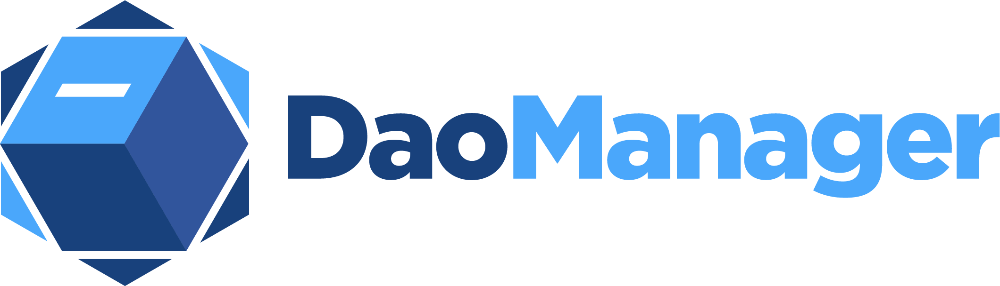
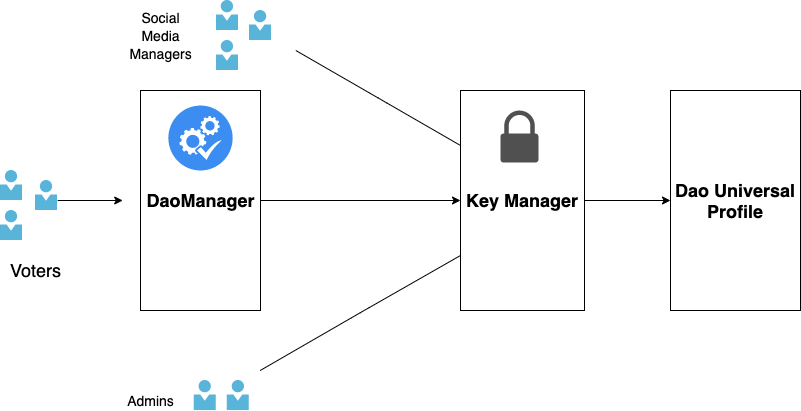
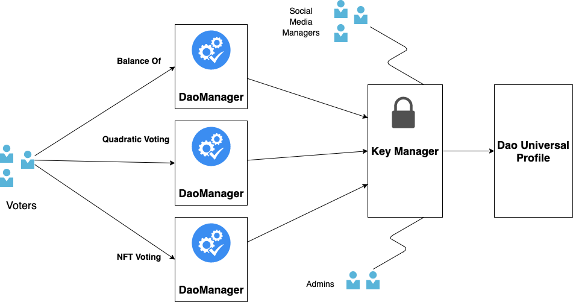

# Dao Manager for Universal Profiles

Secure vote management for Universal Profiles

---
  * [About](#about)
  * [Requirements](#requirements)
  * [Features](#features)
  * [Quick Start](#quick-start-🚀)
    + [1. Download and install](#1-download-and-install)
    + [2. Compiling](#2-compiling-🏗)
    + [3. Contract Migration](#3-contract-migration)
    + [4. Start the user interface](#4-start-the-user-interface)
  * [Contract Configuration](#contract-configuration)
    + [DaoManager -> KeyManager -> Up](#daoManager-->-keymanager-->-up)
  * [Permissions](#permissions)
  * [Future Improvements](#future-improvements-🧪)
  * [Licence](#licence)

---

# About

Dao Manager allows for proposals and voting to securely take place within a Universal Profile. Voting and proposal data are stored within the Up conforming to the `ERC725YJSONSchema`. By leveraging methods in LSP7 Digital Asset, Dao Manager also has the ability for weighted votes at the same time solving the double voting problem.

For more technical documentation head over the the [docs](./docs/DaoManager.md).

[Youtube video](https://www.youtube.com/watch?v=0utd_rnSJfU)

# Authors

Mitchell Tucker : tucker.mitchelltucker.mitchell@gmail.com

# Requirements

* Truffle v1.0.0+
* Git v2.32.0
* Ganache v2.5.4 (recommend not required)
* Nodejs v16.13.1
* Npm v8.1.2

# Features

* Voting management on any authorized Universal Profile
* Proposal creation on any authorized Universal Profile
* Automatic key creation
* Vote data is saved in the Universal Profile
* Important proposal data is saved in the Universal Profile
* Upgradable and removable without effecting data
* Weighted voting using an LSP7Token
* 1 to 1 voting


# Quick Start 🚀

### 1. Download and install

Open your terminal and git clone the repo.

      git clone https://github.com/MitchTODO/DaoManager.git

`cd` into the repo directory and install node packages.

        cd daoManager

        npm install

### 2. Compiling 🏗

With the same terminal compile and build the contracts

        truffle compile

Contracts we will be using.

* Dao Universal Profile
  + [Account.sol]("")
  + [KeyManager.sol]("")

* [DaoManager.sol]("")
* [LSP7Token.sol]("")
* [Migrations.sol]("")


### 3. Contract Migration

What the migrations command will do.

1. Deploys a new Dao Universal Profile

    -  LSP0ERC725Account

    -  LSP6KeyManager

2. Deploys a new LSP7 Tokens used as a governance token.

3. Deploys a Dao Manager that is linked to the new Dao Up and Token

4. Permissions are setup for the owner and Dao Manager

5. Dao Up owner (EOA) is transferred to the keyManager

Check out the [deploy_contracts]("") script to see how this works.

***Note***
You will need the output of the migrations in the next step.

#### Local Testnet


[Ganache GUI](https://trufflesuite.com/ganache/) is used for the is demo but you can use geth, or parity. Just remember to update the network settings in the truffle-config.js

1. Start Ganache GUI

2. With the same terminal run the migration command

        truffle migrate --network development


#### L16 Testnet

1. Update the truffle-config.js with your private key used for deployment. This address must contain native LYXt in order to pay for deployment. Head over to the [L16 faucet](https://faucet.l16.lukso.network) to add liquidity.

2. Run the migrate command with the network parameter set to L16

        truffle migrate --network L16


### 4. Start the user interface

Keep your terminal open and head over the [interface readme](ui/README.md).

## Contract Configuration

By saving proposal and voting data to the Universal Profile many different type of configurations can exist, since no data is saved in the Dao Manager. This also allows a Dao Manager to be upgraded or removed without effecting data.

For more technical info check out the [Dao Manager docs](./docs/DaoManager.md).

### DaoManager -> KeyManager -> Up



As of now this is the only type of configuration that will work with the current Dao Manager contract.

## Permissions

Different permissions will need to be set depending on the type of voting.

- `1to1`

```js
SETDATA: true,
```

- `isOperatorFor` (Weighted)
***Note***
[Deploy_contracts]() script will automatically set these permissions during migration.

```js
SETDATA: true,
TRANSFERVALUE: true,
CALL: true,
```

It is recommend to set the [`AllowedERC725YKeys`](https://docs.lukso.tech/standards/universal-profile/lsp6-key-manager#allowed-erc725y-keys) for every address that has the `setdata` permission as they will be able to manipulate vote data.

## Future Improvements 🧪

### Multiple DaoManagers -> KeyManager -> Up (Experimental)



The idea is your can have multiple Dao Managers with different type of voting strategies. Sharing the same `proposal[]` data key within the Dao Up.

### Quadratic voting

Create a Dao Manager with quadratic voting methods.

### Executable proposals

Voters would contribute to a pool of funds and passing proposals would automatically  transfer funds. This would work great for grants or crowdfunding.


### Interface for DaoManager Factory

Create a space where Ups can join different DaoUps and create new DaoUp similar to snapshot.

# Licence
The project is available under [MIT licence](https://github.com/MitchTODO/DaoManager/blob/main/LICENSE)
