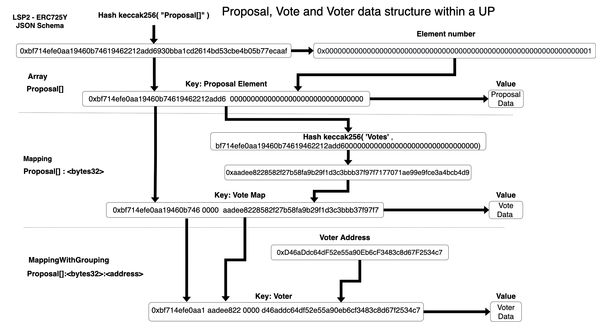
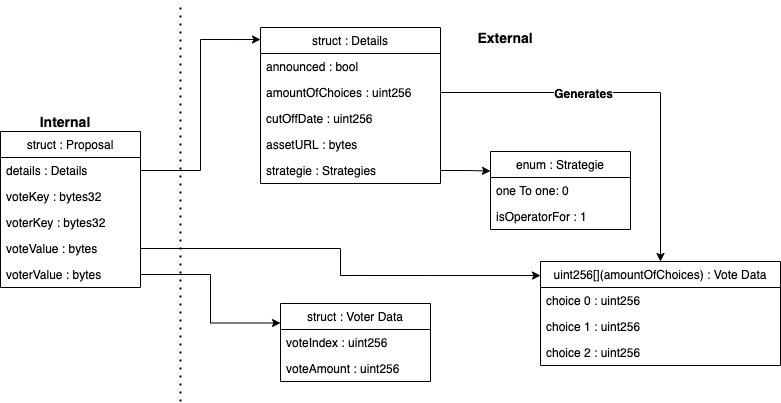
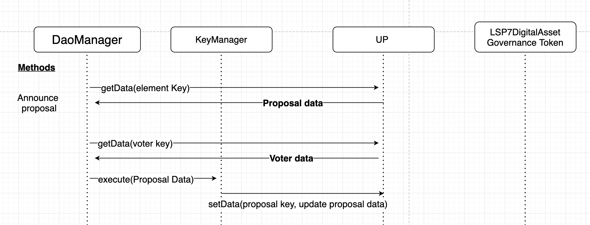
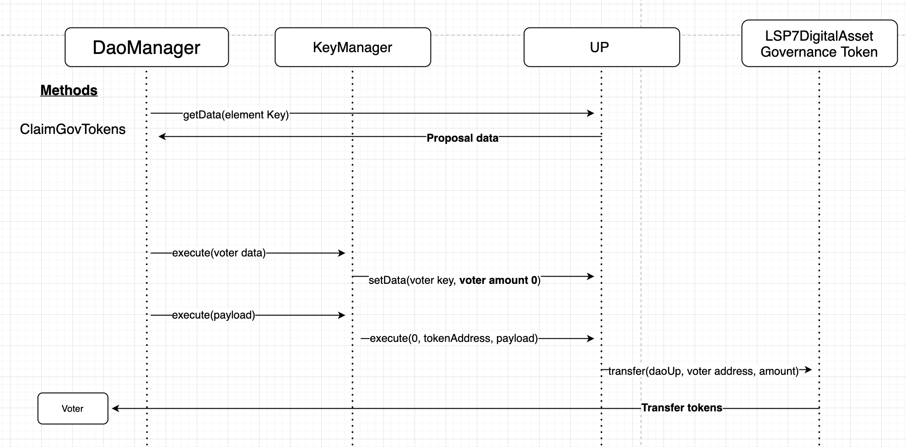
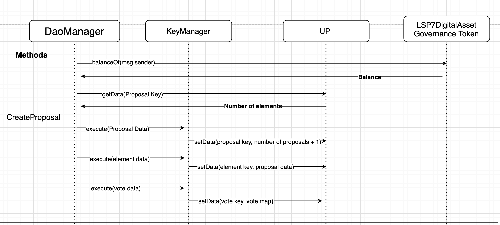
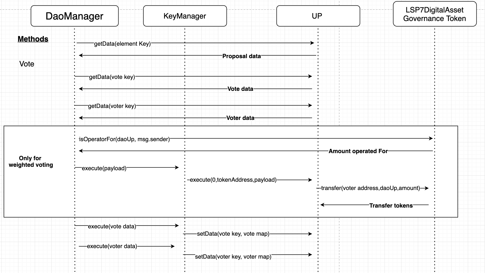
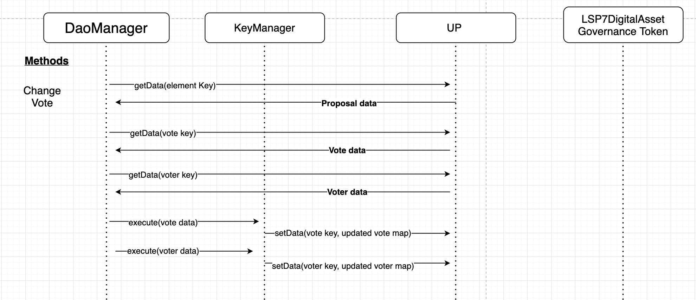
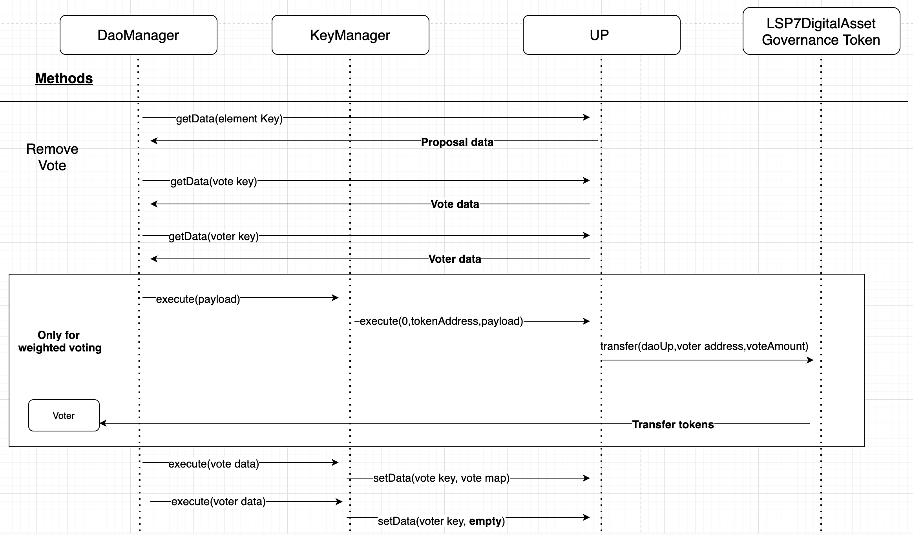

## About

Dao Manager allows for proposals and voting to securely take place within a Up. Relies heavily on the ERC725Y and ERC725X standard for setting, getting and executing. Voting and proposal data are stored within the Up conforming to the `ERC725YJSONSchema` (LSP2). By leveraging methods in LSP7 Digital Asset, Dao Manager also has the ability for weighted votes at the same time solving the double voting problem.


## Architecture

### Data Flow

#### Proposal

Proposals are stored through the using of an array. Proposal data is derived by first hashing the `Proposal[]` string. This key will return the amount of elements (proposals) within the Up. Combining the proposal key and element number together generates a new key (Proposal Element) which returns proposal data from the Dao Up.

#### Vote

Hashing the proposal element key and `Votes` string creates new unique key. This key is used to generate a mapping. Mapping the proposal data to the vote data (Vote Map).


#### Voter

By combining the proposal key, vote map key and an address creates a mapping with grouping. Mapping votes to voters.




---

### Data Model

Proposal data is divided between what is necessary to maintain key features. Below shows what aspects of a proposal is saved in the Dao Up. Information that is not saved in the Dao Up is still linked using an [assetUrl](https://github.com/lukso-network/LIPs/blob/main/LSPs/LSP-2-ERC725YJSONSchema.md#asseturl).

- DaoUP
  - amount of choices
  - cut off date
  - voting strategie
  - assetURL link  
      - **Not Saved**
      - Title
      - Description
      - Choice Titles
      - ...

#### Vote management

Within the proposal method a `uint256` array is created with the size set to the amount of choices the proposal has. This allows for each index to represent a choice and value to represent the amount of votes.

```js
    uint256[] memory newVoteArray = new uint256[](_amountOfChoices);
```


#### Voter

A struct with two `uint256` saves a vote cast by a voter.

1. `voteIndex` : What index choice they voted.
2. `voteAmount` : Amount they voted.




---


### Proposal strategies

Currently only two voting strategies exist `1to1` and `isOperatorFor` i.e. weighted.

#### Weighted Voting

Weighted votes work by utilizing `isOperatorFor`, `authorizeOperator` and `transfer` methods from the `LSP7 DigitalAsset` standard.

How it works

1. Voter will set the amount of voting power they want to allocate to the vote.

    - Calling the token's contract `authorizeOperator` method with DaoUp as the operator and amount

    - This will give the DaoUp the right to access the set amount.

2. Voter cast a vote on a weighted proposal.

    - Calls the `isOperatorFor` to get the DaoUp operator amount
    - Then transfer the operator amount from voter to DaoUp
    - Sets the operator amount into the votes array at the correct index also setting voter data.

3. Voter can get their tokens back in one of two ways.

    - Wait until the poll is over then call `claimGovToken` method.

        - Only `voteAmount` is zero out, keeping the record they voted.

    - While the poll is active call `RemoveVote`

        - Subtract the `voterAmount` from the vote array.

        - Both `voterIndex` and `voterAmount` is zero out

**Note**
  To prevent a double transfer, voter amount is set to 0 before transferring tokens.

## Methods

Contract can be categorized into four sections followed by respective methods.

  - Proposal Creation

   `createProposal`

  - Vote Management

    `vote`
    `changeVote`
    `removeVote`


  - End of poll

    `announceProposal`
    `claimGovToken`

  - Tools (Internal)

    `genVoterKey`
    `genVoteKey`
    `genKey`
    `toBytes`
    `fromBytes`

---
### constructor
```
  constructor(address _keyManager,address _govToken,uint256 _minimumTokenAmount)
```


*Parameters*

  - `_keyManager` address of the key manager for the DaoUp
  - `_govToken` address of governance token that will be used (LSP7 DigitalAsset standard)
  - `_minimumTokenAmount` minimum amount of governance tokens to set a proposal.

---

#### govToken

```
function govToken() external view returns(address)
```
Returns the `address` of the acting governance token.

---

#### target

```
function target() external view returns(address)
```
Returns the `address` of the target contract acting as the DaoUp controlled by the key manager.

---

#### keyManagerAddress

```
function keyManagerAddress() external view returns(uint256)

```
Returns the `address` of the acting key manager.

---

#### minimumTokenAmount

```
function minimumTokenAmount() external view returns(uint256)
```
Returns a `uint256` of the minimum token amount to create a proposal.

---

#### announceProposal

```
function announceProposal() public

```
Emits the winning choice and amount of votes for proposal.

Only callable a single time after the poll is closed.

Sets the announced boolean to `true` in the proposal data.

<details>
  <summary>Method Sequence Diagram</summary>

  
</details>

---

#### claimGovToken

```
  function claimGovToken(bytes32 _elementKey) public
```
Transfers governance tokens back to voters used in voting.

Only callable after the poll is closed

*Parameters*

  - `_elementKey` proposal element that was voted upon.

<details>
  <summary>Method Sequence Diagram</summary>

  
</details>

---

#### createProposal

```
function createProposal(uint8 _strategie,uint8 _amountOfChoices,uint256 _cutoffDate, bytes memory _assetURL) public
```

Create a new proposal within the DaoUp. Sender must have the `minimumTokenAmount` in order to submit a proposal.  

***Note***
Element are increment automatically

*Parameters*
  - `_strategy` voting strategy that will be used.
  - `_amountOfChoices` amount of choices proposal will have
  - `_cutoffDate` cut off date of the poll (Starts immediately)
  - `_assetURL` [AssetUrl]("https://github.com/lukso-network/LIPs/blob/main/LSPs/LSP-2-ERC725YJSONSchema.md#asseturl") of proposal

<details>
  <summary>Method Sequence Diagram</summary>

  
</details>

---

#### vote

```
  function vote(bytes32 _elementKey,uint8 _voteIndex) public
```

Cast a vote for `msg.sender`.

*Parameters*
  - `_elementKey` proposal key
  - `_voteIndex` choice index

<details>
  <summary>Method Sequence Diagram</summary>

  
</details>

---

#### changeVote

```
  function changeVote(bytes32 _elementKey, uint256 _newIndex) public

```
Changes `msg.sender` vote within a given proposal.


*Parameters*
  - `_elementKey` proposal key
  - `_newIndex` updated index voter wants to vote for

<details>
  <summary>Method Sequence Diagram</summary>

  
</details>

---

#### removeVote

```
  function removeVote(bytes32 _elementKey) public
```
Removes `msg.sender` vote within a given proposal.


*Parameters*
  - `_elementKey` proposal key


<details>
  <summary>Method Sequence Diagram</summary>

  
</details>

---
