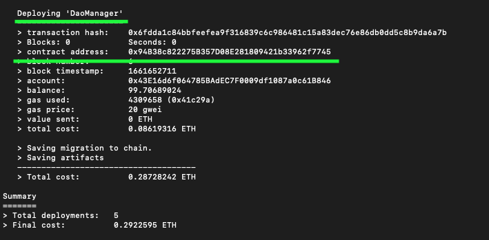

# User Interface for the Dao Manager

## Requirements

* Nodejs v16.13.1
* Npm v8.1.2
* Google Browser
- Text Editor (optional)
- [Successful contract migration](../DaoManager/README.md#2-compiling-🏗) (optional)
- [Universal Profile Browser Extension](https://docs.lukso.tech/guides/browser-extension/install-browser-extension)

Or

- MetaMask Browser Extension 10.18.3

---

If you want to use a pre deployed contract on Lukso's L16 testnet with the interface skip to [Install and start the interface](#install-and-start-the-interface)


## Starting the dapp


### Set your local Dao Manager contract address

 Before starting the dapp we need to get are `daoManager` contract address. The contract address is created during a successful migration. Find and save the contract address for the next step



## Open your text editor and navigate to project directory

1. With your text editor selected and open the `ui/src/config.js` file

2. Copy the contract address from the terminal and past it into line 2.

```js
    export const DaoManagerAddress = " Your Contract address here "
```

## Install and start the interface

1. Open a new terminal and cd into ui directory of the repo

        cd daoManager/ui

 - Install npm libraries

        npm install

2. Launch google and start the dapp

        npm start

The dapp should automatically open in your browser.

If you are using the L16 testnet contract I recommend using the Universal Profile Browser Extension. As it is set up with L16 network provider and the relayer will pay for the transaction cost.

## Dapp Walk through

**Note** Currently the localhost settings on the Universal Profile Browser Extension don't seem to work correctly. Therefor i recommend using MetaMask with the network provider set to your localhost

[Local Dapp Walk through](https://www.youtube.com/watch?v=0utd_rnSJfU)
